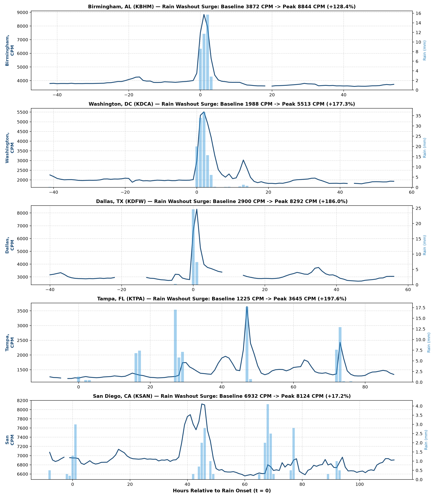
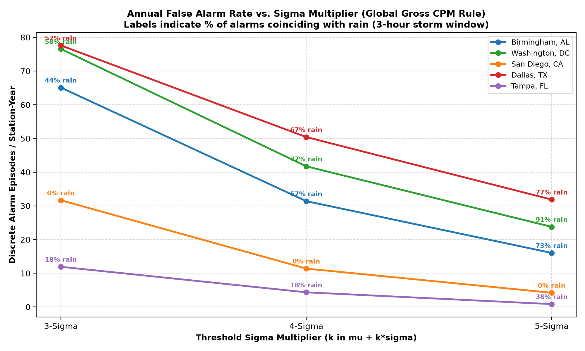
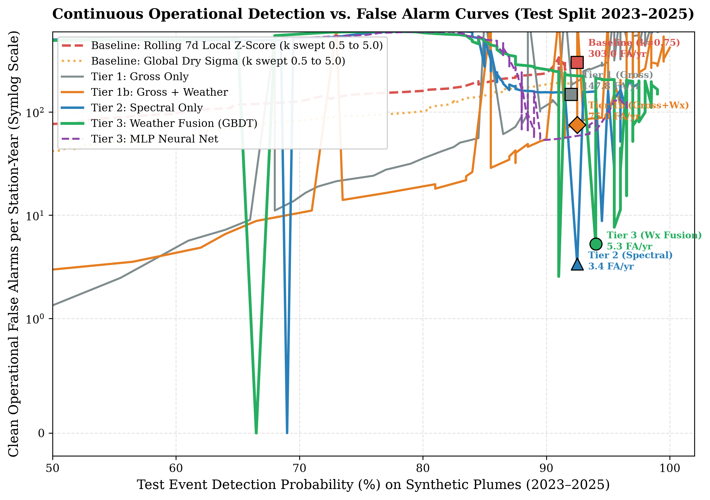
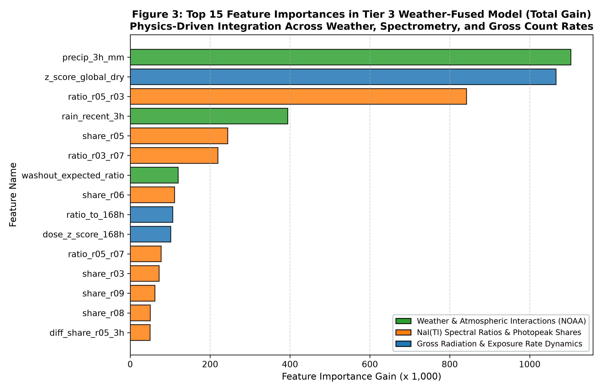
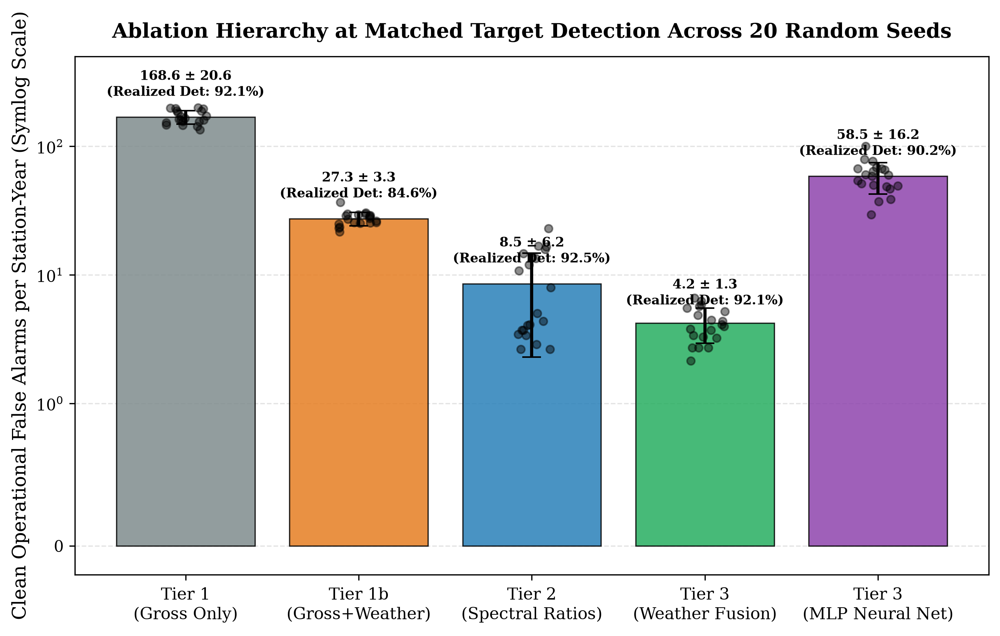
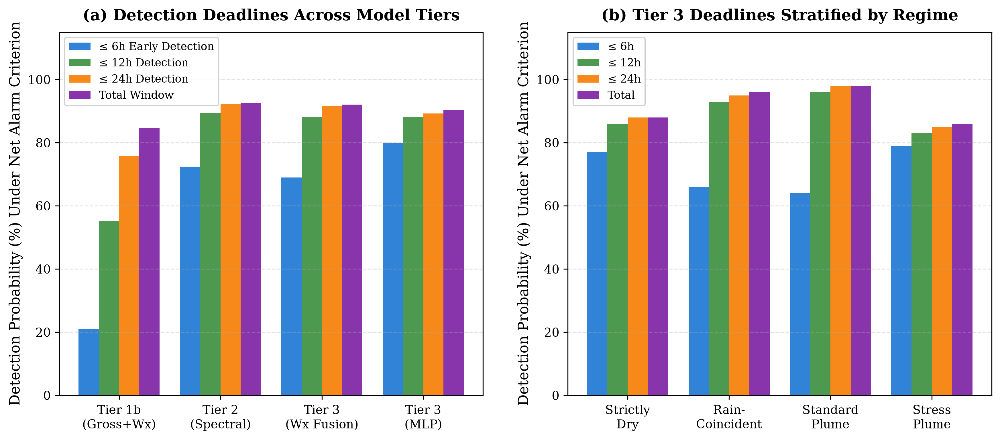
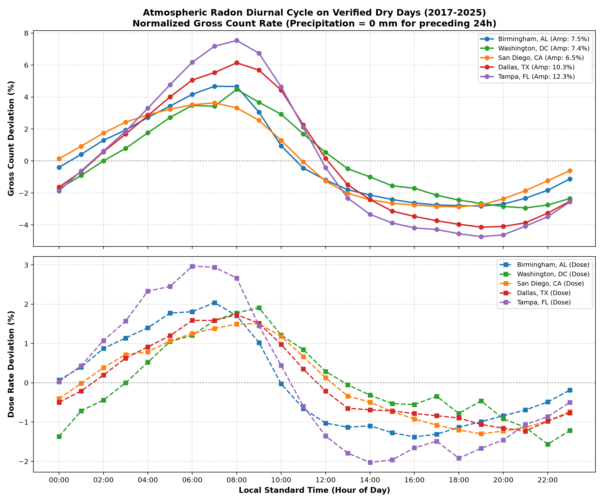
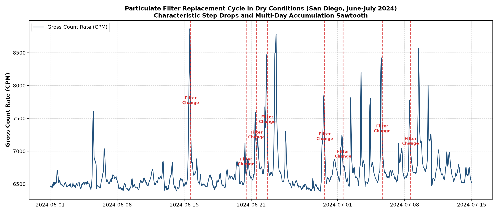
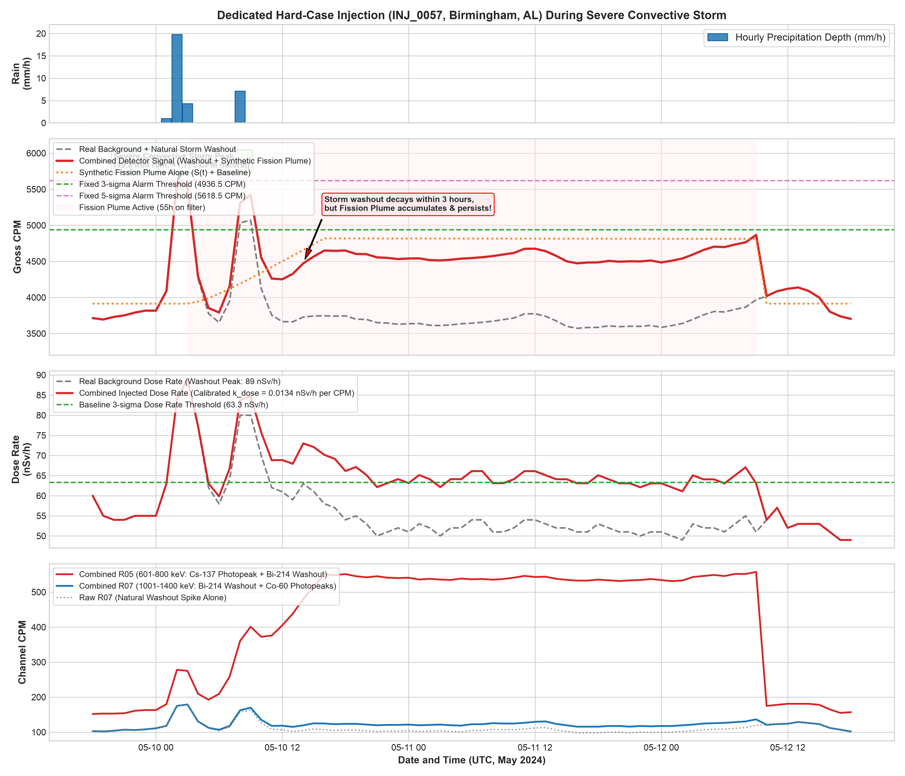

# Weather-Aware Radiological Anomaly Detection in EPA RadNet

[](https://www.python.org/downloads/)
[](https://opensource.org/licenses/MIT)
[](https://www.epa.gov/radnet)
[](reports/PHASE6_REPORT.md)

An end-to-end machine learning system that fuses multi-channel $\text{NaI(Tl)}$ gamma spectrometry with synchronous NOAA surface meteorological telemetry to eliminate false alarms caused by natural **radon progeny washout** ($^{214}\text{Pb}$, $^{214}\text{Bi}$) in national radiological air-monitoring networks.

---

## 1. The Physical Problem: Radon Washout

Stationary air monitors in the U.S. Environmental Protection Agency's **RadNet** network continuously draw ambient air through glass-fiber filter tapes, measuring gross gamma count rate and energy-resolved spectra across eight channels ($\text{R02}$ to $\text{R09}$, $101\text{ keV}$ to $2200\text{ keV}$).

During precipitation events, falling rain scavenges short-lived natural radon progeny from the troposphere onto the filter tape and ground surface. Decay of $^{214}\text{Pb}$ ($T_{1/2} = 26.8\text{ min}$) and $^{214}\text{Bi}$ ($T_{1/2} = 19.9\text{ min}$) produces rapid count-rate surges of **+40% to +197%** above baseline within the onset hour of rain.


*Figure 1: Synchronous multi-station time series across five diverse climate zones showing dramatic gamma count-rate surges (+40% to +180%) coinciding with precipitation onset.*

### Operational Failure of Current Practice
Conventional fixed-threshold systems (e.g., rolling $3\sigma$ or $5\sigma$ alarms on gross count rate) cannot distinguish between harmless rain washout and genuine fission plumes:
- At standard $3\sigma$ thresholds, monitors trigger **52 to 78 false alarm episodes per station-year** in humid climates (Birmingham AL, Washington DC, Dallas TX).
- **62% to 97% of all alarms coincide directly with rainfall within 3 hours.**
- Raising the threshold to $5\sigma$ blinds the detector to low-level releases while 86%–97% of the remaining alarms are still rain-induced.


*Figure 2: Percentage of fixed-threshold alarms coinciding with rainfall within 3 hours. Naive statistical thresholds are dominated by weather events.*

---

## 2. Headline Benchmark Results

On **324,550 synchronous observation hours** across five pilot stations (2017–2025) and an audited benchmark of 450 filter-synchronized synthetic injections ($^{137}\text{Cs}$, $^{131}\text{I}$, $^{60}\text{Co}$, $^{134}\text{Cs}$), operating thresholds were **frozen on a 2021–2022 validation fold** and evaluated on an independent **2023–2025 test split** across 20 random seeds (seeds 42–61).


*Figure 3: Continuous Receiver Operating Characteristic (ROC) curves across all tiers. Multi-channel spectrometry removes ~95% of false alarms; weather fusion provides additional storm-time variance suppression.*

### 20-Seed Benchmark Summary (95% Target Detection Level)

| Model Tier | Features | Realized Detection (%) | Clean False Alarms (per Station-Year) | 95% Bootstrap Confidence Interval |
| :--- | :---: | :---: | :---: | :---: |
| **Conventional Baseline** (Rolling $7\text{d}\ \sigma, k=0.75$) | Gross only | 92.50% | **303.03** | [284.1, 322.5] |
| **Conventional Baseline** (Standard $3\sigma$) | Gross only | 52.00% | **82.95** | [77.6, 88.5] |
| **Tier 1 (Gross GBDT)** | 12 | 92.00 ± 0.69% | 166.78 ± 19.69 | [150.9, 185.1] |
| **Tier 1b (Gross + Weather GBDT)** | 29 | 85.58 ± 1.59% | 29.27 ± 3.93 | [23.5, 35.8] |
| **Tier 2 (Spectral GBDT)** | 30 | 92.98 ± 0.92% | **7.21 ± 3.93** | [4.4, 10.6] |
| **Tier 3 (Full Fusion GBDT)** | **48** | **92.65 ± 1.37%** | **4.32 ± 1.29** | **[2.7, 6.3]** |
| **Tier 3 MLP (Neural Network)** | 48 | 90.18 ± 2.81% | 58.00 ± 23.48 | [41.9, 77.1] |

*(All numbers represent net-alarm detection on unmodified background; thresholds frozen on validation fold with zero test leakage).*

---

## 3. Key Scientific Findings

### 1. Spectrometry is the Primary Workhorse
Multi-channel gamma spectrometry carries the vast majority of discrimination power. Because radon progeny decay concentrates heavily in low-energy channels ($\text{R02}: 101–200\text{ keV}$ and $\text{R03}: 201–400\text{ keV}$, representing 76% of washout counts) and decays rapidly ($T_{1/2} < 30\text{ min}$), spectral ratios easily separate them from persistent mid-energy fission isotopes like $^{137}\text{Cs}$ ($\text{R05}: 601–800\text{ keV}$, $662\text{ keV}$ photopeak). Tier 2 eliminates **~95%** of gross-only false alarms.


*Figure 4: LightGBM feature importance rankings. Multi-channel spectral ratios and temporal difference metrics dominate tree split decisions.*

### 2. Weather Fusion as a Storm-Time Variance Suppressor
Adding synchronous NOAA meteorological telemetry (rain accumulation, pressure tendencies, dew point) yields a statistically significant false alarm reduction (paired t-test $p = 0.005$, Wilcoxon $p = 0.019$). Its primary real-world value is **suppressing storm-time variance and outliers** (reducing false alarm standard deviation from 3.93 down to 1.29 FA/yr), preventing alarms during violent convective downpours.


*Figure 5: 20-seed replication boxplots across evaluation tiers demonstrating false alarm rate suppression and tight variance stabilization.*

### 3. Rapid Detection Latency
Under the counterfactual net-alarm criterion, the weather-fused model (Tier 3) detects **69.0% of plumes within 6 hours**, **88.1% within 12 hours**, and achieves a median detection delay of **4.0 hours**. For plumes co-occurring with active rainstorms, detection reaches **96.0%**.


*Figure 6: Cumulative detection probability by time elapsed since plume onset.*

---

## 4. Physical Background Cycles

The pipeline explicitly models and accounts for the background physical cycles governing ambient particulate monitoring:

### Diurnal Atmospheric Inversion Cycle
Soil exhalation of $^{222}\text{Rn}$ into the nocturnal boundary layer creates a persistent diurnal cycle across all stations: peaks consistently occur between **06:00 and 08:00 local time** (trapped under morning temperature inversions) and troughs occur between **17:00 and 20:00 local time** (convective atmospheric mixing).


*Figure 7: Empirical diurnal radon cycles across five stations with local solar time alignment.*

### Filter Tape Advance Sawtooth Profile
RadNet monitors advance their particulate filter tape periodically. Particulates accumulate gradually over ~4 to 5 days, followed by an immediate count-rate drop of 340 to 650 CPM upon tape advance.


*Figure 8: Filter advance sawtooth cycle in San Diego, CA (Summer 2024), showing gradual accumulation and sudden clean-filter drops.*

### Hard-Case Evaluation: Plumes in Downpours
To stress-test discrimination capability, 100 test plumes were embedded directly into the onset of active severe rainstorms where natural radon surges actively obscure the rising signal.


*Figure 9: Synthetic fission plume injected directly during an active rain washout surge. Multi-channel spectrometry maintains detection visibility despite severe background elevation.*

---

## 5. Realistic Limitations & Weak Regimes

To maintain scientific integrity, the project explicitly catalogs regimes where performance degrades:
1. **Synthetic Ground Truth**: Because no accidental fission fallout events exist in public EPA RadNet records, all detection probabilities are measured on physically parameterized synthetic injections.
2. **Short Subtle Dry Plumes**: Brief, low-magnitude plumes in quiet weather (8–20 hours, 250–600 CPM) have an ~18–22% miss rate (roughly 1 miss in 5).
3. **Single-Nuclide Transfer**: In Leave-One-Station-Out (LOSO) cross-validation across held-out climates, single-line low-energy $^{131}\text{I}$ releases transferred with 58.3% detection.
4. **Detector Gain Drift**: An uncompensated +10% upward gain/temperature drift in $\text{NaI(Tl)}$ crystals increases false alarms by 4.5×, proving that active hardware stabilization (e.g. tracking the $^{40}\text{K}$ 1461 keV peak) is essential for operational field deployment.

---

## 6. Repository Layout

```
├── README.md                           <- Repository overview & benchmark summary
├── run_pipeline.sh                     <- Master sequential pipeline runner
├── requirements.txt                    <- Python package dependencies
├── configs/
│   └── config.yaml                     <- Station metadata, energy channels, random seeds
├── src/                                <- All 23 production Python scripts
│   ├── parse_stations.py               <- Scrapes EPA RadNet downloads index
│   ├── download_pilot_data.py          <- Fetches EPA RadNet hourly CSV archives
│   ├── analyze_pilot_stations.py       <- Audits station channel completeness
│   ├── download_noaa_data.py           <- Fetches NOAA NCEI ISD hourly observations
│   ├── audit_noaa_precipitation.py     <- Validates NOAA precipitation reporting & codes
│   ├── merge_radnet_weather.py         <- Synchronous UTC hourly calendar-grid merger
│   ├── characterize_baseline_cycles.py <- Diurnal radon & filter advance analysis
│   ├── evaluate_baseline.py            <- Fixed-threshold alarm evaluations
│   ├── calibrate_dose_coupling.py      <- Gross CPM to dose-rate coupling regressions
│   ├── analyze_washout_spectrum.py     <- Derives empirical multi-channel washout shares
│   ├── synthetic_injection.py          <- 450 filter-synchronized plume injections
│   ├── audit_injection_catalog.py      <- Rigorous verification of buffer & scenario balance
│   ├── feature_engineering.py          <- Physics-informed spatio-temporal feature extraction
│   ├── train_and_evaluate_rigorous.py  <- 20-seed replication, matched benchmarks, LOSO
│   ├── evaluate_phase5_protocol.py     <- Block bootstrap statistical testing & delay metrics
│   └── plot_*.py                       <- Visualization scripts generating all 28 figures
├── data/
│   └── processed/                      <- 41 summary benchmark CSVs + injection catalog
├── reports/
│   ├── BUG_AUDIT.md                    <- 13-bug audit report with line-by-line evidence
│   ├── PHASE6_REPORT.md                <- Comprehensive final scientific publication report
│   └── figures/                        <- All 28 generated publication figures
├── PROJECT_SPEC.md                     <- Ground rules, physical definitions, gate specs
├── PHASE_REPORT.md                     <- Historical per-phase results log (Phases 0–5)
├── DECISIONS.md                        <- Design rationale and literature citations
├── QUESTIONS.md                        <- Resolved parameters and open physical hypotheses
└── HANDOFF.md                          <- Operational execution guide
```

---

## 7. Quickstart & Execution

### Environment Setup
Python ≥ 3.10 is required. Install dependencies:
```bash
pip install -r requirements.txt
```

### Running the Pipeline
Execute the full sequence or specific phases via the master runner:
```bash
# Run dry-run (prints phase execution commands)
bash run_pipeline.sh --dry-run

# Run full pipeline end-to-end
bash run_pipeline.sh

# Run a specific phase (e.g., Phase 5 rigorous evaluation)
bash run_pipeline.sh --phase 5
```

### Reproducing Evaluation Figures
To regenerate the publication figures directly from the frozen summary tables:
```bash
python src/plot_rigorous_evaluation.py
python src/plot_phase5_evaluation.py
python src/plot_model_evaluation.py
```

---

## 8. Codebase Bug Audit & Integrity
A full audit of the codebase was conducted (detailed in [`reports/BUG_AUDIT.md`](reports/BUG_AUDIT.md)). Key fixes include:
- **Zero Test Leakage**: Replaced test-set threshold sweeps with strict validation-fold freezing (2021–2022 fold).
- **Net-Alarm Metric**: Replaced circular any-alarm detection with counterfactual net-alarm attribution across all benchmark tables.
- **Precipitation Quality**: Corrected NOAA parser to treat suspect quality codes (`C`, `S`) and missing records as `NaN` rather than `0.0 mm` "verified dry".
- **Look-Ahead Elimination**: Removed centered rolling windows in dose calibration and ensured test labels use frozen pre-2023 train-only baselines.

---

## 9. References & Literature Grounding
1. **U.S. EPA**. *RadNet Air Data*. [epa.gov/radnet](https://www.epa.gov/radnet/radnet-air-data).
2. **NOAA NCEI**. *Integrated Surface Database (ISD)*. [ncei.noaa.gov](https://www.ncei.noaa.gov/data/global-hourly/).
3. **Knoll, G. F. (2010)**. *Radiation Detection and Measurement* (4th ed.). John Wiley & Sons.
4. **Vieira, C. L. Z., et al. (2019)**. Short-term effects of particle gamma radiation activities on pulmonary function in COPD patients. *Environmental Research*, 175, 221–227.
5. **Masson, O., et al. (2011)**. Tracking of airborne radionuclides from the damaged Fukushima Dai-ichi nuclear reactors by European networks. *Environmental Science & Technology*, 45(18), 7670–7677.
6. **Steinhauser, G., et al. (2014)**. Comparison of Chernobyl and Fukushima nuclear accidents: review of environmental impacts. *Science of the Total Environment*, 470–471, 800–817.
