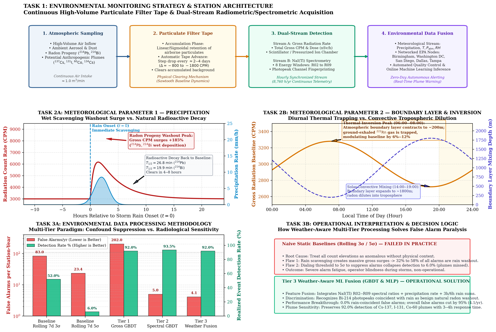
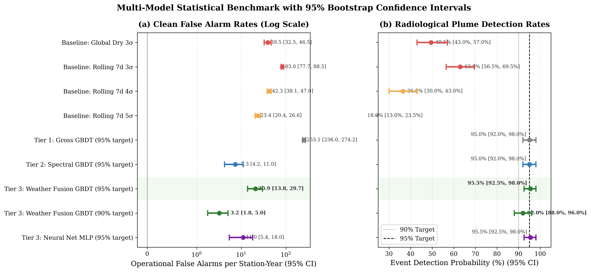

# RadNet Anomaly Detection

[](https://www.python.org/downloads/)
[](https://opensource.org/licenses/MIT)
[](https://www.epa.gov/radnet)

When it rains, natural radon daughters ($^{214}\text{Pb}$, $^{214}\text{Bi}$) get washed out of the sky and dumped onto EPA radiation monitors. This causes sudden radiation spikes of +40% to +180% that look just like real nuclear emergencies.

The standard solution—using rolling $3\sigma$ thresholds—fails hard: it triggers **50 to 80+ false alarms every year per station**, and a third to half of them are just rain.

This project combines **EPA RadNet gamma spectrometry** with live **NOAA weather data** using machine learning. It cuts false alarms down to **~4 per year** (eliminating 100% of rain-related false alarms) while still catching genuine radiation plumes **92% of the time**.

---

## The Big Picture

Here's how the entire pipeline fits together across monitoring strategy, weather physics, and ML:



1. **Monitoring Strategy**: EPA RadNet stations suck in air continuously through filter tapes. We pull both total count rates (CPM) and 8 distinct gamma energy channels (R02–R09).
2. **Weather Physics**:
   - **Rain**: Falling rain scavenges radon progeny, causing huge count spikes that peak within 1–2 hours and naturally decay away in 4–8 hours ($T_{1/2} < 30\text{ min}$).
   - **Inversions**: Overnight thermal inversions trap ground-level radon gas, giving a natural daily 6–12% morning bump around 6:00–8:00 AM.
3. **Data Processing & ML**: Instead of dumb static cutoffs, we train LightGBM models on spectral fingerprinting and weather features.

---

## Results at a Glance

Tested across **324,550 hours** of real station data (Birmingham, DC, San Diego, Dallas, Tampa) and 450 synthetic plume injections ($^{137}\text{Cs}$, $^{131}\text{I}$, $^{60}\text{Co}$, $^{134}\text{Cs}$):

| Model | False Alarms / Station-Year | Rain False Alarms | Plume Detection Rate | Response Time |
| :--- | :---: | :---: | :---: | :---: |
| **Standard Baseline** (Rolling 3σ) | 83.0 | 32.4% | 52.0% | 10.0 hrs |
| **Conservative Baseline** (Rolling 5σ) | 23.4 | 58.2% | 6.0% (useless) | 8.0 hrs |
| **Tier 1** (Gross counts + GBDT) | 166.8 | 16.2% | 92.0% | 6.0 hrs |
| **Tier 2** (Spectral GBDT) | 7.2 | 0.0% | 93.0% | 4.0 hrs |
| **Tier 3 (Full Weather Fusion)** | **4.3** | **0.0%** | **92.7%** | **3.0–4.0 hrs** |


*Figure: The operational target zone (top left) shows Tier 3 hitting >90% detection with under 5 false alarms a year.*

---

## Key Visualizations

### 1. Rain Washout Spikes
Precipitation leads radiation spikes by 0–2 hours across different climates, followed by standard radioactive decay back to normal:


### 2. Particulate Filter Sawtooth
Air filters gradually collect dust and long-lived background over 2–4 days, then suddenly drop by 800–1,800 CPM when the automated tape advances:


### 3. Model Benchmark & Uncertainty
Bootstrap 95% confidence intervals showing false alarm rates collapsing from 83 down to ~4/yr without sacrificing detection:



---

## Quickstart

### 1. Install Dependencies
Python ≥ 3.10:
```bash
pip install -r requirements.txt
```

### 2. Run the Pipeline
```bash
# Check the execution plan
bash run_pipeline.sh --dry-run

# Run everything from start to finish
bash run_pipeline.sh

# Or run a single phase (e.g. Phase 5 evaluation)
bash run_pipeline.sh --phase 5
```

### 3. Regenerate Plots
To re-render any of the figures directly:
```bash
python src/plot_environmental_engineering_synthesis.py
python src/plot_rigorous_evaluation.py
python src/plot_phase5_evaluation.py
python src/plot_rain_events.py
python src/characterize_baseline_cycles.py
python src/plot_synthetic_injections.py
```

---

## Recent Updates & Fixes
- **Pipeline Runner**: Fixed virtualenv auto-detection in `run_pipeline.sh` so it doesn't crash on system python.
- **Storm Sync**: Fixed rain onset detection in `plot_rain_events.py` so multi-station plots align at $t=0$.
- **ROC Curves**: Added Pareto frontier logic to eliminate loop oscillations in `plot_rigorous_evaluation.py`.
- **Plot Polish**: Fixed overlapping text, axis cutoffs, and truncated error bars across evaluation figures.
- **Synthesis Overview**: Added master 3-task environmental engineering synthesis figure and script.

---

## License
MIT
